# Nymstr Chat Flows

Complete documentation of all message flows in the Nymstr privacy-preserving messaging system. All communication is routed through the [Nym mixnet](https://nymtech.net/) for network-level anonymity and encrypted end-to-end with MLS (RFC 9420).

---

## Table of Contents

- [1. Authentication](#1-authentication)
  - [1.1 Registration](#11-registration)
  - [1.2 Login](#12-login)
- [2. User Discovery](#2-user-discovery)
- [3. Direct Messages (1:1)](#3-direct-messages-11)
  - [3.1 DM Handshake (MLS Session Setup)](#31-dm-handshake-mls-session-setup)
  - [3.2 Sending & Receiving Encrypted DMs](#32-sending--receiving-encrypted-dms)
- [4. Group Messaging](#4-group-messaging)
  - [4.1 Group Creation & Registration](#41-group-creation--registration)
  - [4.2 Member Invitation (Admin Approval + MLS Welcome)](#42-member-invitation-admin-approval--mls-welcome)
  - [4.3 Sending Group Messages](#43-sending-group-messages)
  - [4.4 Fetching Group Messages](#44-fetching-group-messages)
- [5. Epoch Synchronization](#5-epoch-synchronization)
- [6. Offline Message Delivery](#6-offline-message-delivery)
- [7. Epoch-Aware Buffering](#7-epoch-aware-buffering)
- [8. Message Routing (Client)](#8-message-routing-client)
- [9. Message Format Reference](#9-message-format-reference)

---

## 1. Authentication

Both registration and login use a **nonce-challenge protocol** to cryptographically prove ownership of a PGP private key without transmitting it.

### 1.1 Registration

A new user registers by proving they control the PGP key pair they claim. The server issues a random nonce, the client signs it, and the server verifies the signature against the submitted public key.

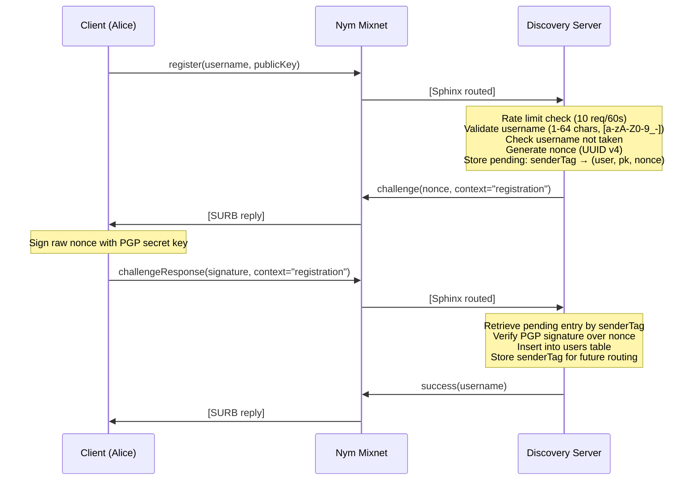

**Server DB operations:**
```sql
-- On success
INSERT INTO users (username, publicKey, senderTag) VALUES (?, ?, ?)
```

**Cleanup:** Pending entries expire after 5 minutes (TTL cleanup runs on each incoming message).

### 1.2 Login

Login re-authenticates an existing user using the same nonce-challenge protocol. The critical difference: the server **updates the senderTag** because Nym clients get a new ephemeral address each session.

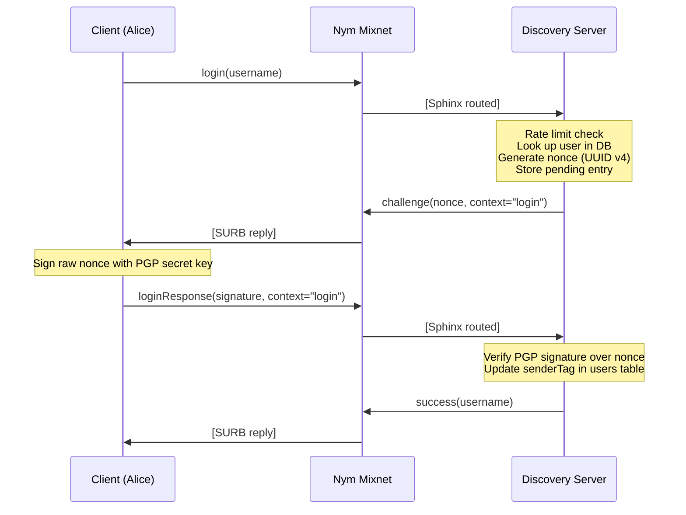

**Server DB operations:**
```sql
-- Update ephemeral Nym address for message routing
UPDATE users SET senderTag = ? WHERE username = ?
```

---

## 2. User Discovery

Before initiating a conversation, clients look up other users' public keys via the discovery server.

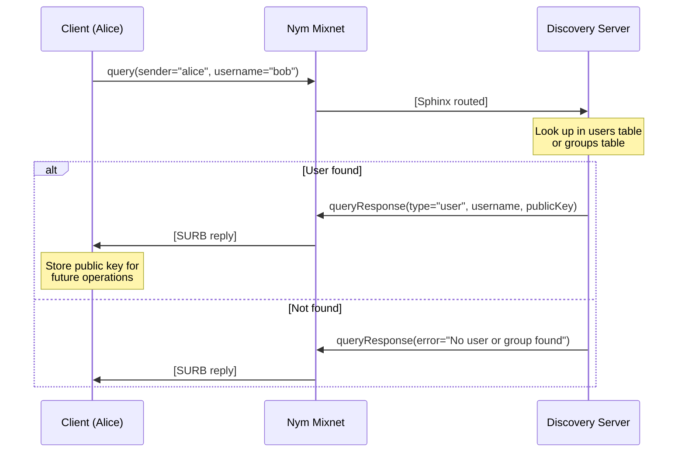

Group discovery uses the same mechanism with `queryGroups` to find public group servers.

---

## 3. Direct Messages (1:1)

### 3.1 DM Handshake (MLS Session Setup)

The DM handshake establishes a 2-person MLS group for encrypted messaging. It uses a **consent-based key package exchange** (users must explicitly accept contact requests) followed by a **deferred commit pattern** (the initiator waits for acknowledgment before finalizing).

The conversation ID is deterministic and normalized alphabetically: `dm:<min(alice,bob)>:<max(alice,bob)>`.

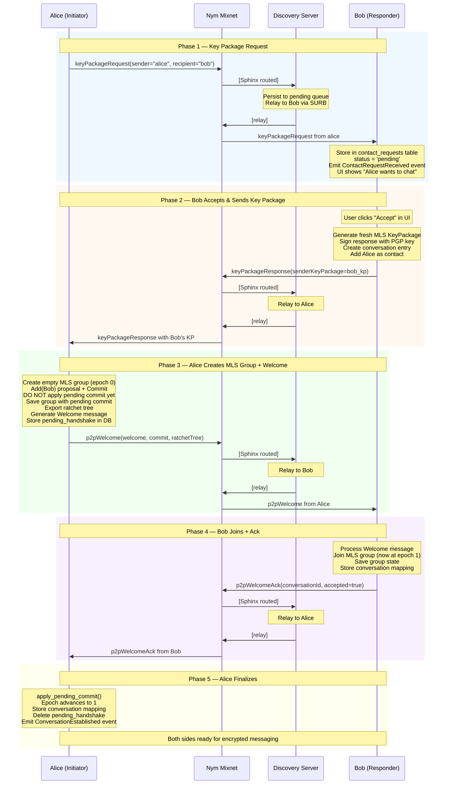

**Key design decisions:**
- **Consent on KP exchange:** Users must explicitly approve contact requests before their KeyPackage is sent. This is an intentional departure from RFC 9420's pre-published KP model to preserve Nymstr's privacy-first design.
- **Deferred commit:** Alice does not apply her Commit until Bob confirms he processed the Welcome via `p2pWelcomeAck`. This prevents epoch divergence if Bob never processes the Welcome (e.g., offline, crashed).
- **Restart resilience:** The pending handshake is stored in SQLite (`pending_handshakes` table), so Alice can recover and finalize even after a restart.

**DB tables involved:**

| Table | Side | Purpose |
|-------|------|---------|
| `contact_requests` | Bob | Stores pending/accepted/denied requests |
| `pending_handshakes` | Alice | Tracks unfinalized handshakes (deleted on finalize) |
| `conversations` | Both | Stores conversation ID, participant, MLS group ID |
| `contacts` | Bob | Adds Alice as a contact on acceptance |

### 3.2 Sending & Receiving Encrypted DMs

Once the handshake is complete, messages are encrypted with MLS and relayed through the discovery server.

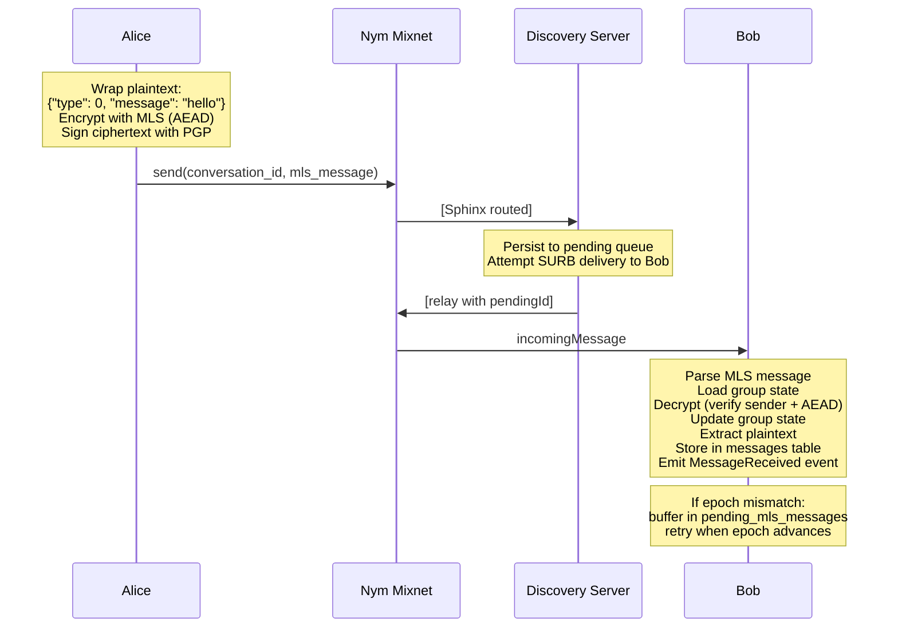

**Encryption details:**
- **Cipher suite:** CURVE25519_AES128 (ECDH + AES-128-GCM)
- **Per-message keys:** Derived from current epoch's master secret via MLS key schedule
- **Forward secrecy:** Achieved through epoch ratcheting on commits
- **Authentication:** GCM tag provides integrity; sender credential verified by MLS

---

## 4. Group Messaging

Group messaging uses a **pull model** — the group server stores encrypted messages and members fetch them on demand. Messages are encrypted client-side with MLS before being sent to the server, so the server only sees opaque ciphertext.

### 4.1 Group Creation & Registration

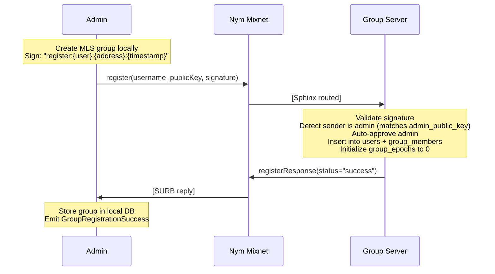

**Separate discovery registration:**

After creating the group, the admin registers it with the discovery server so other users can find it:

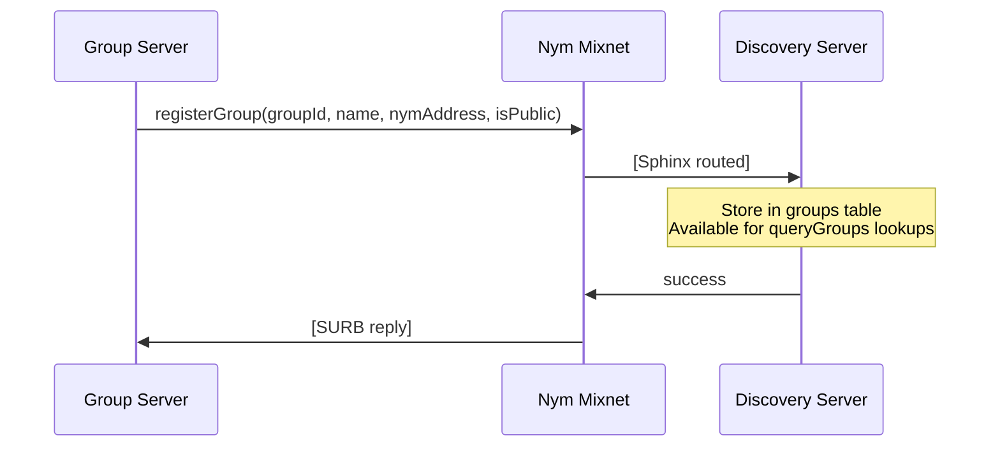

### 4.2 Member Invitation (Admin Approval + MLS Welcome)

Adding a member to a group is a multi-step process: the user registers with the group server, the admin approves them (receiving their KeyPackage), adds them to the MLS group, and stores the Welcome message for the new member to fetch.

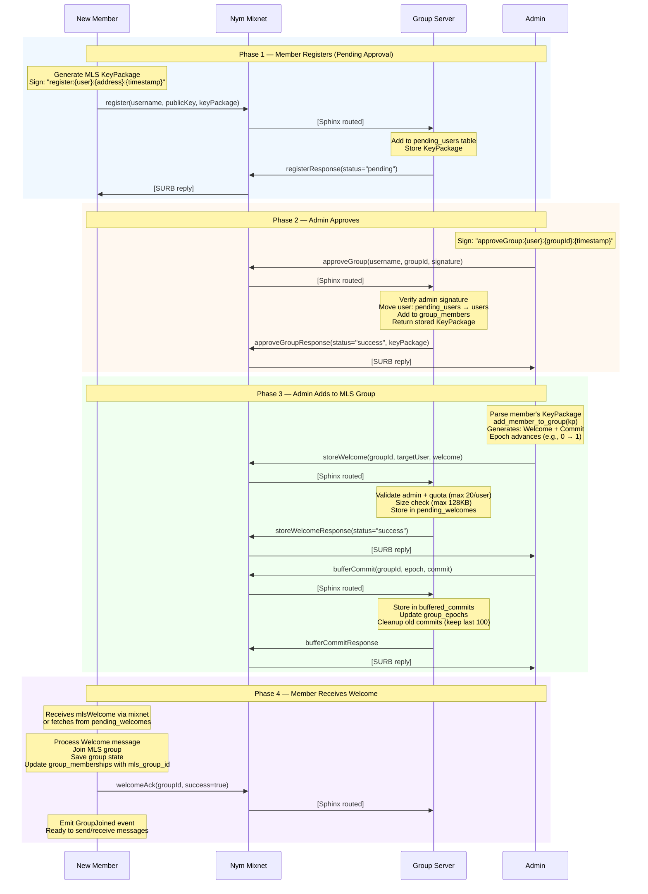

### 4.3 Sending Group Messages

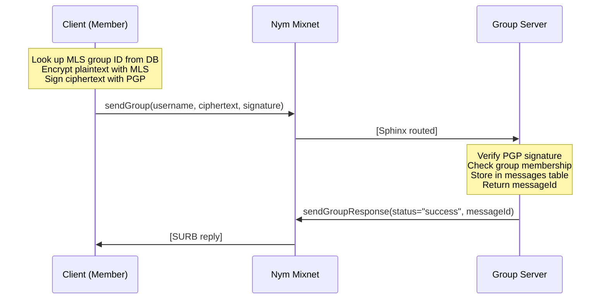

**Key invariant:** Sending application messages does NOT advance the MLS epoch. Only commits (adding/removing members) advance epochs.

### 4.4 Fetching Group Messages

Group messages use a **cursor-based pull model**. Clients track the last message ID they've seen and fetch newer messages.

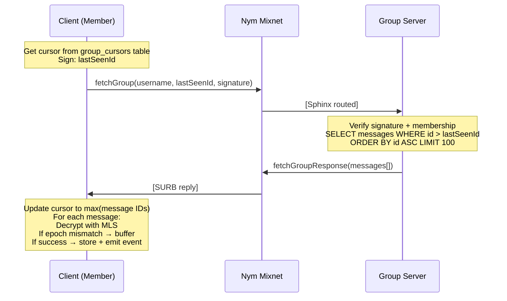

---

## 5. Epoch Synchronization

When a client misses a commit (e.g., was offline during a member addition), it cannot decrypt messages from the new epoch. The `syncEpoch` flow fetches buffered commits from the server to catch up.

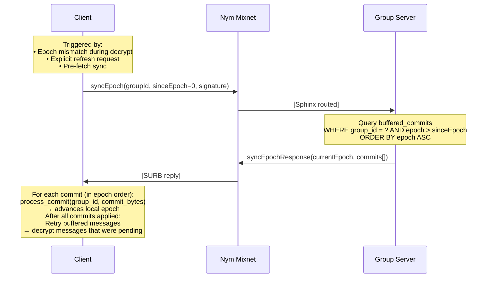

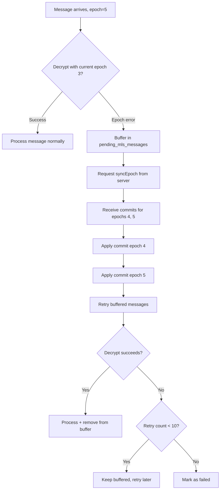

---

## 6. Offline Message Delivery

The discovery server implements a **persist-then-relay** pattern. Every relayed message is saved to a pending queue first, then best-effort delivery is attempted via SURB. If the recipient is offline, messages accumulate in the queue until fetched.

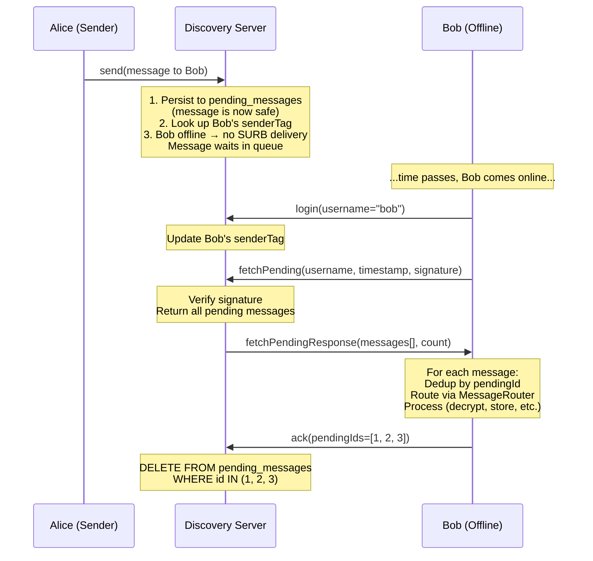

**Delivery guarantees:**
- **At-least-once:** Messages persist until explicitly ACKed
- **Deduplication:** Client tracks seen `pendingId` values in a HashSet (capacity 2000) to prevent double-processing when the same message arrives via both SURB and fetchPending
- **Durability:** Messages survive server restarts (SQLite-backed)

**Actions that use relay with persistence:**

| Action | Purpose |
|--------|---------|
| `send` | P2P encrypted messages |
| `keyPackageRequest` | MLS handshake initiation |
| `keyPackageResponse` | MLS key package exchange |
| `p2pWelcome` | MLS welcome for 1:1 DM |
| `p2pWelcomeAck` | Welcome acknowledgment |
| `groupJoinResponse` | Group membership confirmation |

---

## 7. Epoch-Aware Buffering

The Nym mixnet introduces variable latency and packet reordering. Messages may arrive encrypted for an epoch the client hasn't reached yet. The epoch buffer handles this gracefully.

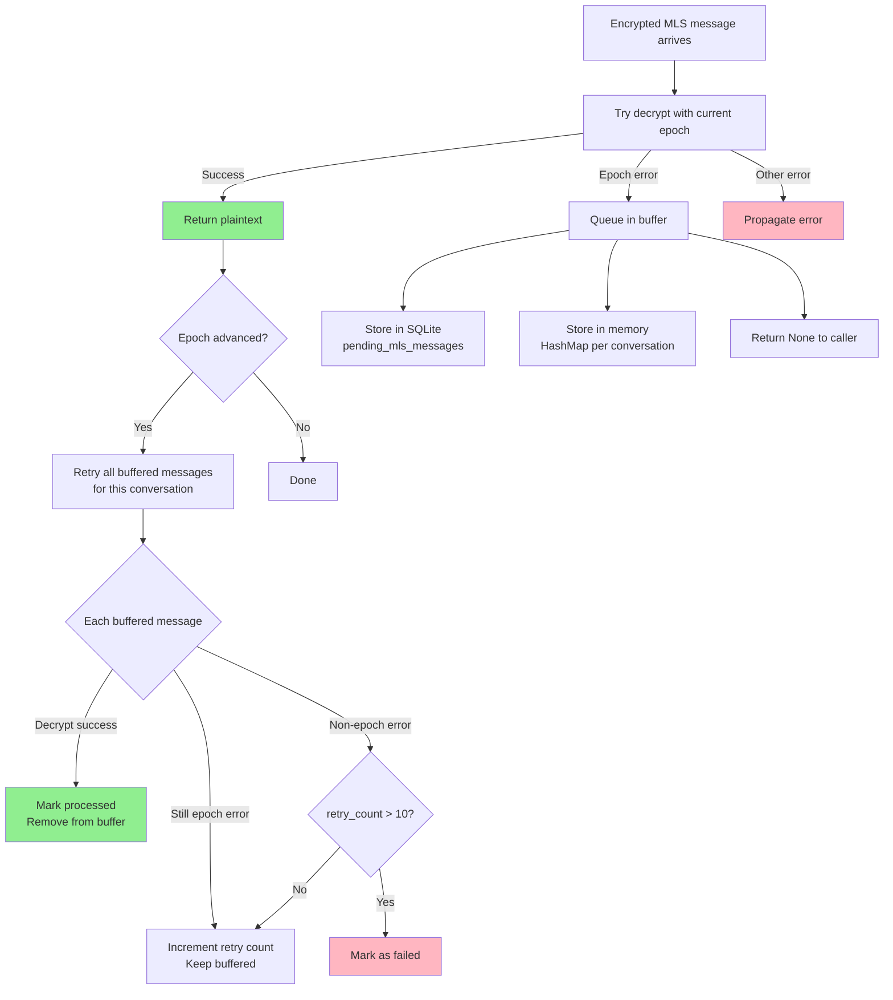

**Buffer limits:**

| Parameter | Value | Purpose |
|-----------|-------|---------|
| `MAX_BUFFER_AGE_SECS` | 300 (5 min) | Messages older than this are cleaned up |
| `MAX_BUFFER_SIZE` | 100 | Per-conversation memory buffer limit |
| `MAX_RETRY_COUNT` | 10 | Attempts before marking as failed |

**Epoch error detection** — the buffer triggers on errors containing any of these strings:
`epoch`, `generation`, `stale`, `wrong epoch`, `future epoch`, `old epoch`, `cannot decrypt`, `secret tree`, `ratchet`

**Startup recovery:** On application start, `reload_from_db()` restores pending messages from SQLite into the memory buffer, ensuring durability across restarts.

---

## 8. Message Routing (Client)

The client routes incoming messages by their `action` field. Each route type has a dedicated handler.

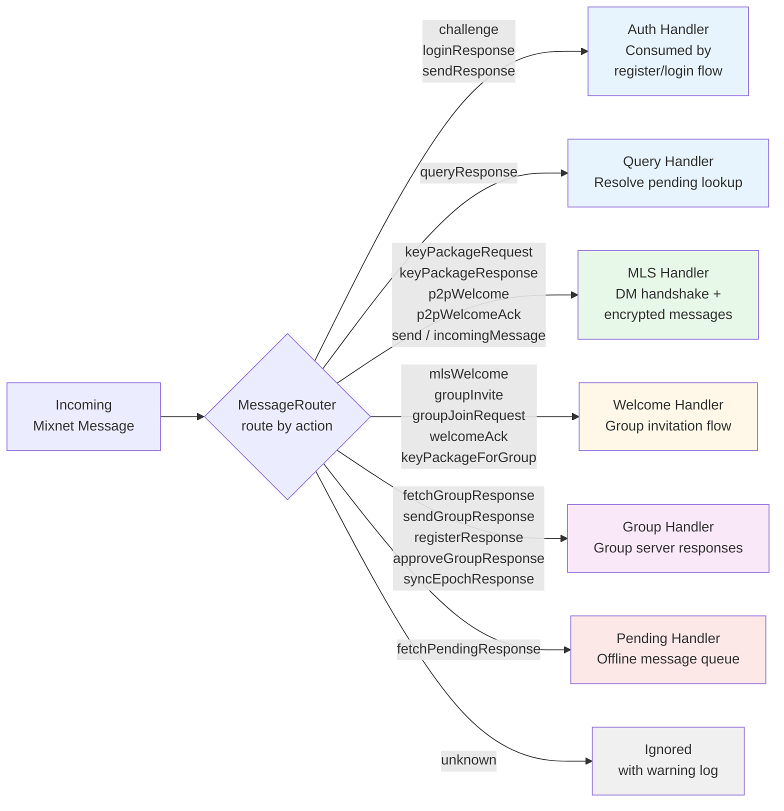

**Processing behavior:**

| Route | Immediate? | Notes |
|-------|-----------|-------|
| Authentication | No | Consumed by auth command flow via channel |
| Query | No | Resolved via pending query state |
| MLS Protocol | Yes | Handshake + encrypted message handling |
| Welcome Flow | Yes | Group invitation processing |
| Group | Yes | Group server response handling |
| Pending Delivery | Yes | Offline queue processing |
| Unknown | No | Dropped with warning |

---

## 9. Message Format Reference

All messages use a unified JSON envelope:

```json
{
  "type": "message | response | system",
  "action": "<action_name>",
  "sender": "<username or 'server'>",
  "recipient": "<username or service>",
  "payload": { },
  "signature": "<base64 PGP signature>",
  "timestamp": "<ISO 8601 / RFC 3339>"
}
```

### Action Catalog

#### Authentication

| Action | Direction | Payload | Purpose |
|--------|-----------|---------|---------|
| `register` | C → S | `username`, `publicKey` | Start registration |
| `login` | C → S | `username` | Start login |
| `challenge` | S → C | `nonce`, `context` | Server challenge |
| `challengeResponse` | C → S | `signature`, `context` | Signed nonce |
| `loginResponse` | C → S | `signature`, `context` | Signed login nonce |

#### Discovery

| Action | Direction | Payload | Purpose |
|--------|-----------|---------|---------|
| `query` | C → S | `username` | Look up user/group |
| `queryResponse` | S → C | `type`, `username`, `publicKey` | Lookup result |
| `queryGroups` | C → S | — | Discover public groups |

#### DM Handshake

| Action | Direction | Payload | Purpose |
|--------|-----------|---------|---------|
| `keyPackageRequest` | C → S → C | _(empty)_ | Request contact's KP |
| `keyPackageResponse` | C → S → C | `senderKeyPackage` | Provide KP |
| `p2pWelcome` | C → S → C | `welcomeMessage`, `groupId`, `commitMessage`, `ratchetTree` | MLS Welcome + Commit |
| `p2pWelcomeAck` | C → S → C | `conversationId`, `accepted` | Confirm Welcome processed |

#### Encrypted Messaging

| Action | Direction | Payload | Purpose |
|--------|-----------|---------|---------|
| `send` | C → S → C | `conversation_id`, `mls_message` | Encrypted DM |
| `incomingMessage` | S → C | `conversation_id`, `mls_message` | Received DM |

#### Group Operations

| Action | Direction | Payload | Purpose |
|--------|-----------|---------|---------|
| `sendGroup` | C → G | `username`, `ciphertext`, `signature` | Send group message |
| `sendGroupResponse` | G → C | `status`, `messageId` | Send confirmation |
| `fetchGroup` | C → G | `username`, `lastSeenId`, `signature` | Fetch messages since cursor |
| `fetchGroupResponse` | G → C | `messages[]` | Batch of encrypted messages |
| `approveGroup` | C → G | `username`, `groupId`, `signature` | Admin approves member |
| `approveGroupResponse` | G → C | `status`, `keyPackage` | Returns member's KP |
| `registerGroup` | G → S | `groupId`, `name`, `nymAddress` | Register group with discovery |

#### MLS Welcome Flow (Groups)

| Action | Direction | Payload | Purpose |
|--------|-----------|---------|---------|
| `storeWelcome` | C → G | `groupId`, `targetUsername`, `welcome` | Store Welcome for member |
| `mlsWelcome` | G → C | `groupId`, `welcome_bytes`, `epoch`, `ratchetTree` | Deliver Welcome |
| `welcomeAck` | C → G | `groupId`, `success` | Confirm group join |
| `bufferCommit` | C → G | `groupId`, `epoch`, `commit` | Store commit for sync |
| `syncEpoch` | C → G | `groupId`, `sinceEpoch` | Fetch missed commits |
| `syncEpochResponse` | G → C | `currentEpoch`, `commits[]` | Commits since requested epoch |
| `keyPackageForGroup` | C → S → C | `groupId`, `keyPackage` | KP for group invitation |

#### Offline Delivery

| Action | Direction | Payload | Purpose |
|--------|-----------|---------|---------|
| `fetchPending` | C → S | `timestamp`, `signature` | Request queued messages |
| `fetchPendingResponse` | S → C | `messages[]`, `count` | Queued messages |
| `ack` | C → S | `pendingIds[]` | Acknowledge processed messages |

---

*Last updated: 2026-02-07*
